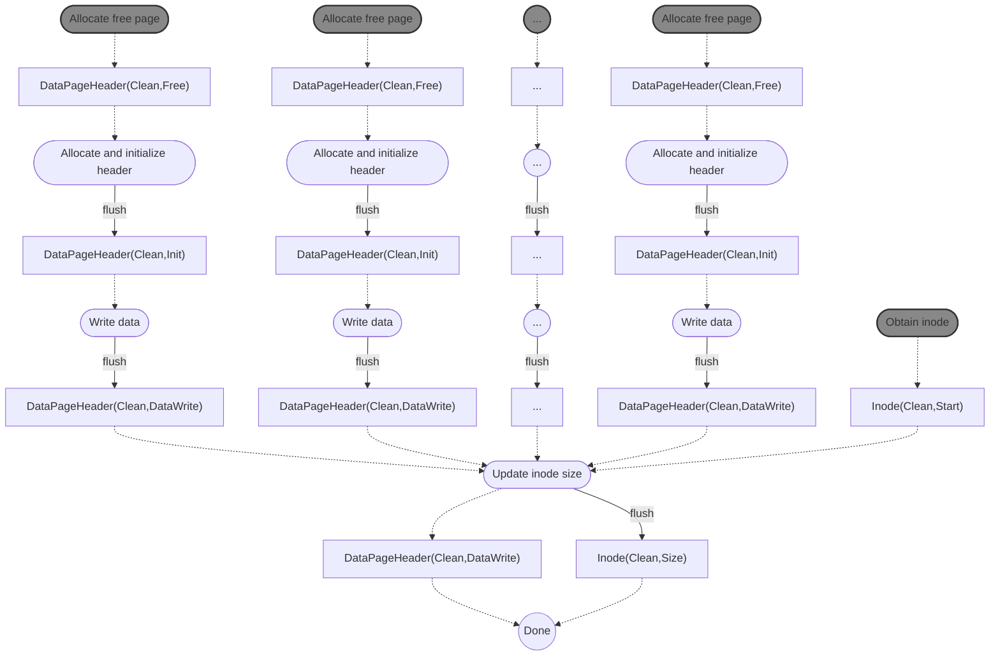

# Dependencies v1

**creat**
```mermaid
graph TB
  A0([Allocate ino number]) -.-> A
	A["Inode(Clean,Free)"] -.-> B([Persistently allocate inode]) 
	B --clwb--> C["Inode(InFlight,Alloc)"]
	D0([Allocate free dentry in parent]) -.-> D
	D["Dentry(Clean,Free)"] -.-> E([Persistently allocate dentry]) 
	E --clwb--> F["Dentry(InFlight,Alloc)"]
	C & F --- G[ ]:::empty
	G --fence--> H["Inode(Clean,Alloc)</br>Dentry(Clean,Alloc)"]
	H -.-> I([Set ino in dentry])
	I --flush--> J["Dentry(Clean,Init)"] -.-> K((Done))
	%%DRAM0([Initialize page index for new file])
	%%DRAM1([Add new dentry to directory tree])
classDef empty width:0px,height:0px;
classDef gray fill:#888,stroke:#333,stroke-width:2px;
class A0,D0,DRAM0,DRAM1 gray
```

**mkdir**
```mermaid
graph TD
subgraph set up new inode
  A0([Allocate ino number]) -.-> A
	A["Inode(Clean,Free)"] -.-> B([Allocate inode])
	B --clwb--> C["Inode(InFlight,Alloc)"]
end
subgraph set up new dir page
	D([Allocate free page]) -.-> E["DirPageHeader(Clean,Free)"]
	E -.-> F([Set type/metadata in header])
	F --flush--> G["DirPageHeader(Clean,Alloc)"]
	G -.-> H([Set .. dentry])
	H --clwb--> I["DirPageHeader(InFlight,Alloc)</br>Dentry(InFlight,Init)"]
end
subgraph point page to inode
	I & C --- J[ ]:::empty
	J --flush--> J1["Inode(Clean,Alloc)</br>Dentry(Clean,Init)</br>DirPageHeader(Clean,Alloc)"] -.-> K([Set ino in page header])
	K --clwb-->L1["DirPageHeader(InFlight,Init)"]
end
	K -.-> L2["Dentry(Clean,Init)</br>Inode(Clean,Alloc)"]
subgraph new dentry in parent
	M([Allocate free dentry in parent]) -.-> N["Dentry(Clean,Free)"]
	N -.-> O([Set name and len in new dentry])
	O --clwb--> O1["Dentry(InFlight,Alloc)"]
end
subgraph increment parent links
	P([Obtain parent inode]) -.-> Q["Inode(Clean,Start)"] -.-> R([Inc link count])
	R --clwb--> T["Inode(InFlight,IncLink)"]
end
subgraph point parent to new inode
	U([Set ino in parent dentry])
	O1 & T & L1 --- empty[ ]:::empty
	empty --fence--> U["Inode(Clean,IncLink)</br>Dentry(Clean,Alloc)</br>DirPageHeader(Clean,Init)"]
	U -.-> V([Set inode in parent dentry])
	V --flush--> W["Dentry(Clean,Init)"]
end
	V -.-> X["Inode(Clean,IncLink)</br>DirPageHeader(Clean,Init)"]
	W & X & L2 -.-> Y((Done))
	
classDef empty width:0px,height:0px;
classDef gray fill:#888,stroke:#333,stroke-width:2px;
class A0,D,M,P gray
```

**Allocate a new page for an existing directory**


**write** (with page allocation)

`DataPageHeader`s may have typestate that reflects the state of data in the page rather than the metadata in the header. We may be able to reduce the number of separate flushes/fences by being a bit smarter about the order in which we add pages and update the inode size, but right now it's all kept separate.

**link**
```mermaid
graph TD
  A([Allocate free dentry in parent]) -.-> B["Dentry(Clean,Free)"]
	B -.-> C([Set name and len in new dentry])
	C --clwb--> D["Dentry(InFlight,Alloc)"]
	E([Obtain inode]) -.-> F["Inode(InFlight,Start)"]
	F -.-> G([Increment link count])
	G --clwb--> H["Inode(InFlight,IncLink)"]
	D & H ---- I[ ]:::empty
	I --fence--> J0["Inode(Clean,IncLink)</br>Dentry(Clean,Alloc)"] -.-> J([Set ino in dentry])
	J --flush--> K["Dentry(Clean,Init)"]
	J -.-> L["Inode(Clean,IncLink)"]
	K & L -.-> Z((Done))


classDef empty width:0px,height:0px;
classDef gray fill:#888,stroke:#333,stroke-width:2px;
class A,E gray
```

**unlink** (no hard links to file)
```mermaid
graph TD

A([Obtain dentry in parent]) -.-> B["Dentry(Clean,Start)"] 
B -.-> C([Zero ino in parent dentry])
C --flush--> D["Dentry(Clean,ClearIno)"]
D -.-> E([Zero other dentry metadata]) --clwb--> F["Dentry(InFlight,Dealloc)"]
G([Obtain inode]) -.-> H["Inode(Clean,Start)"] -.-> I([Deallocate inode])
D -.-> I
I --clwb--> J["Inode(InFlight,Dealloc)"]
K([Obtain data pages]) -.-> L0["DataPageHeader(Clean,Start)"]
K -.-> L1["DataPageHeader(Clean,Start)"]
K -.-> L2[...]
K -.-> L3["DataPageHeader(Clean,Start)"]
L0 -.-> M0([Zero page data]) --clwb--> N0["DataPageHeader(InFlight,Zero)"]
L1 -.-> M1([Zero page data]) --clwb--> N1["DataPageHeader(InFlight,Zero)"]
L2 -.-> M2([...]) --clwb--> N2[...]
L3 -.-> M3([Zero page data]) --clwb--> N3["DataPageHeader(InFlight,Zero)"]
D -.-> M0 & M1 & M2 & M3
N0 & N1 & N2 & N3 --- O[ ]:::empty --fence--> P["DataPageHeader(Clean,Zero)</br>DataPageHeader(Clean,Zero)</br>...</br>DataPageHeader(Clean,Zero)</br>"]
P -.-> Q([Deallocate data pages]) --clwb--> R["DataPageHeader(InFlight,Dealloc)</br>DataPageHeader(InFlight,Dealloc)</br>...</br>DataPageHeader(InFlight,Dealloc)</br>"]
F & J & R --- S[ ]:::empty --fence--- T[ ]:::empty
T --> U["Dentry(Clean,Dealloc)"]
T --> V["Inode(Clean,Dealloc)"]
T --> W["DataPageHeader(Clean,Dealloc)</br>DataPageHeader(Clean,Dealloc)</br>...</br>DataPageHeader(Clean,Dealloc)</br>"]
U & V & W -.-> Z((Done))

classDef empty width:0px,height:0px;
classDef gray fill:#888,stroke:#333,stroke-width:2px;
class A,G,K gray
```
If we miss some pages in this operation (in any way - either by zeroing them but not deallocating or not updating them at all) it's technically just a space leak that can be fixed using `fsck`, so it does not impact crash consistency. Still, it would be nice to have a way for the compiler to help us with this, if possible.

**unlink** (there are hard links to the file)
```mermaid
graph TD

A([Obtain dentry in parent]) -.-> B["Dentry(Clean,Start)"] 
B -.-> C([Zero ino in parent dentry])
C --flush--> D["Dentry(Clean,ClearIno)"]
D -.-> E([Zero other dentry metadata]) --clwb--> F["Dentry(InFlight,Dealloc)"]
G([Obtain inode]) -.-> H["Inode(Clean,Start)"]
H -.-> I([Decrement link count]) --clwb--> J["Inode(InFlight,DecLink)"]
F & J --- L[ ]:::empty --fence--- M["Dentry(Clean,Dealloc)</br>Inode(Clean,DecLink)"]
M -.-> Z((Done))

classDef empty width:0px,height:0px;
classDef gray fill:#888,stroke:#333,stroke-width:2px;
class A,G gray
```

**rmdir**

```mermaid
graph TD

A([Obtain dentry in parent]) -.-> B["Dentry(Clean,Start)"]
B -.-> C([Zero ino in parent dentry])
C --flush--> D["Dentry(Clean,ClearIno)"]
E([Obtain inode]) -.-> E0["Inode(Clean,Start)"]
F([Obtain parent inode]) -.-> F0["Inode(Clean,Start)"]
G([Obtain dir page]) -.-> G0["DirPageHeader(Clean,Start)"]
D -.-> H([Zero other dentry metadata]) --clwb--> I["Dentry(InFlight,Dealloc)"]
D -.-> J
E0 -.-> J([Deallocate inode]) --clwb--> K["Inode(InFlight,Dealloc)"]
F0 -.-> L([Decrement parent link count]) --clwb--> M["Inode(InFlight,DecLink)"]
D -.-> L
N([Obtain .. dentry]) -.-> O["Dentry(Clean,Start)"]
O -.-> P([Clear .. dentry]) --clwb--> Q["Dentry(InFlight,Dealloc)"]
C -.-> P
I & M & Q & K --- R[ ]:::empty --fence--- S[ ]:::empty
S --> T["Dentry(Clean,Dealloc)"]
S --> V["Inode(Clean,Dealloc)"]
S --> W["Inode(Clean,DecLink)"]
S --> U["Dentry(Clean,Dealloc)"]
U & G0 -.-> X([Deallocate dir page])
X --flush--> Y["DirPageHeader(Clean,Dealloc)"]
T & V & W & Y -.-> Z((Done))

classDef empty width:0px,height:0px;
classDef gray fill:#888,stroke:#333,stroke-width:2px;
class A,E,F,G,N gray
```
There will only be one `DirPageHeader` to worry about because we can only delete a directory once it is empty.

**truncate** (reducing size)
```mermaid
graph TD

subgraph Decrease file size
A([Obtain inode]) -.-> B["Inode(Clean,Start)"]
B -.-> C([Decrease file size])
C --flush--> D["Inode(Clean,Size)"]
end
D -.-> E4 & E5 & E6 & E7
E([Obtain data pages to remove])  -.-> E0["DataPageHeader(Clean,Start)"] -.-> E4([Zero page data])
E -.-> E1["DataPageHeader(Clean,Start)"] -.-> E5([Zero page data])
E -.-> E2[...] -.-> E6([...])
E -.-> E3["DataPageHeader(Clean,Start)"] -.-> E7([Zero page data])
E4 --clwb--> F0["DataPageHeader(InFlight,Zero)"]
E5 --clwb--> F1["DataPageHeader(InFlight,Zero)"]
E6 --clwb--> F2[...]
E7 --clwb--> F3["DataPageHeader(InFlight,Zero)"]
F0 & F1 & F2 & F3 --- G[ ]:::empty
G --flush--- H["DataPageHeader(Clean,Zero)</br>DataPageHeader(Clean,Zero)</br>...</br>DataPageHeader(Clean,Zero)"]
H -.-> I([Deallocate data pages])
I --flush--> J["DataPageHeader(Clean,Dealloc)</br>DataPageHeader(Clean,Dealloc)</br>...</br>DataPageHeader(Clean,Dealloc)"]
J -.-> Z((Done))


classDef empty width:0px,height:0px;
classDef gray fill:#888,stroke:#333,stroke-width:2px;
class A,E gray
```

**truncate** (increasing size)
Should look the same as write, except that the pages will be zeroed instead of having data written to them. We should use the `WriteData` state for this, not `Zero`, since `Zero` corresponds to deallocation and this operation performs allocation.

**fallocate** (default mode)
Should look the same as truncate (increasing size).

**fallocate** (`FALLOC_FL_KEEP_SIZE`)
```mermaid
graph TD

A([Allocate free page]) -.-> A0["DataPageHeader(Clean,Free)"]
B([Allocate free page]) -.-> B0["DataPageHeader(Clean,Free)"]
C([...]) -.-> C0[...]
D([Allocate free page]) -.-> D0["DataPageHeader(Clean,Free)"]
A0 -.-> A1([Init page header]) --clwb--> A2["DataPageHeader(InFlight,Alloc)"]
B0 -.-> B1([Init page header]) --clwb--> B2["DataPageHeader(InFlight,Alloc)"]
C0 -.-> C1([...]) --clwb--> C2[...]
D0 -.-> D1([Init page header]) --clwb--> D2["DataPageHeader(InFlight,Alloc)"]
A2 & B2 & C2 & D2 --- E[ ]:::empty
E --fence--> F["DataPageHeader(Clean,Alloc)</br>DataPageHeader(Clean,Alloc)</br>...</br>DataPageHeader(Clean,Alloc)"]
F -.-> G([Update block count]) -.-> Z((Done))

classDef empty width:0px,height:0px;
classDef gray fill:#888,stroke:#333,stroke-width:2px;
class A,B,C,D,G gray
```
Size is stored persistently but block count will be stored in DRAM.

**symlink**
```mermaid
graph TD
A([Alloc ino number])
B([Alloc free dentry in parent])
C([Alloc page])

A -.-> D["Inode(Clean,Free)"]
B -.-> E["Dentry(Clean,Free)"]
C -.-> F["DataPageHeader(Clean,Free)"]

D -.-> G([Persistently allocate inode as symlink])
G --clwb--> H["Inode(InFlight,Alloc)"]

E -.-> I([Set name and len in dentry])
I --clwb--> J["Dentry(InFlight,Alloc)"]

F-.-> K([Alloc/init page header])
K --clwb--> L["DataPageHeader(InFlight,Init)"]

H & J & L --- M[ ]:::empty
M --fence--- N[ ]:::empty

N --> O["Inode(Clean,Alloc)"]
N --> P["Dentry(Clean,Alloc)"]
N --> Q["DataPageHeader(Clean,Init)"]

Q -.-> R([Set symlink path in page])
R --flush--> S["DataPageHeader(Clean,Symlink)"]
O & P & S -.-> T([Set ino in dentry])
T -.-> U["Inode(Clean,Alloc)"]
T --flush---> V["Dentry(Clean,Init)"]
T -.-> W["DataPageHeader(Clean,Symlink)"]

U & V & W -.-> Z((Done))


classDef empty width:0px,height:0px;
classDef gray fill:#888,stroke:#333,stroke-width:2px;
class A,B,C gray
```
It should be safe to set the size of the inode when allocating/initializing it, since the inode won't be valid until a dentry points to it anyway. Need to clarify when to use `Alloc` vs `Init` typestate for pages.

**rename** (new name)

**rename** (overwriting old name)