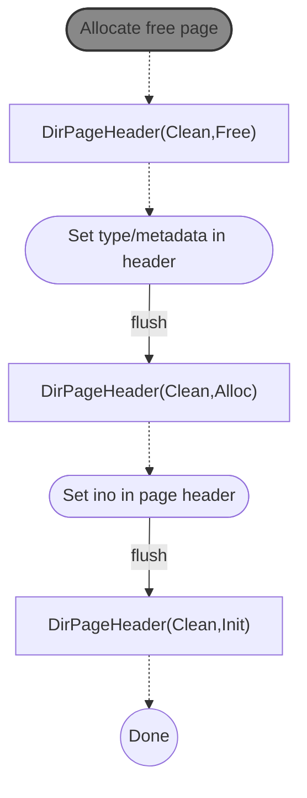
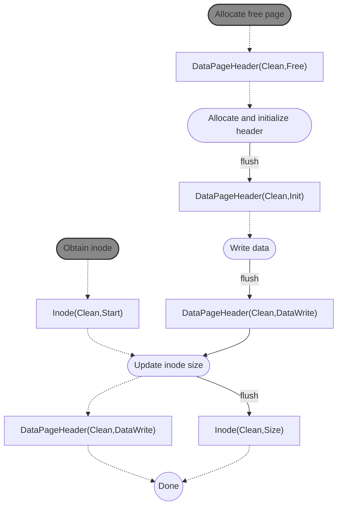

# Dependencies v1

**creat**
```mermaid
graph TB
  A0([Allocate ino number]) -.-> A
	A["Inode(Clean,Free)"] -.-> B([Persistently allocate inode]) 
	B --clwb--> C["Inode(InFlight,Alloc)"]
	D0([Allocate free dentry in parent]) -.-> D
	D["Dentry(Clean,Free)"] -.-> E([Persistently allocate dentry]) 
	E --clwb--> F["Dentry(InFlight,Alloc)"]
	C & F --- G[ ]:::empty
	G --fence--> H["Inode(Clean,Alloc)</br>Dentry(Clean,Alloc)"]
	H -.-> I([Set ino in dentry])
	I --flush--> J["Dentry(Clean,Init)"] -.-> K((Done))
	%%DRAM0([Initialize page index for new file])
	%%DRAM1([Add new dentry to directory tree])
classDef empty width:0px,height:0px;
classDef gray fill:#888,stroke:#333,stroke-width:2px;
class A0,D0,DRAM0,DRAM1 gray
```

**mkdir**
```mermaid
graph TD
subgraph set up new inode
  A0([Allocate ino number]) -.-> A
	A["Inode(Clean,Free)"] -.-> B([Allocate inode])
	B --clwb--> C["Inode(InFlight,Alloc)"]
end
subgraph set up new dir page
	D([Allocate free page]) -.-> E["DirPageHeader(Clean,Free)"]
	E -.-> F([Set type/metadata in header])
	F --flush--> G["DirPageHeader(Clean,Alloc)"]
	G -.-> H([Set .. dentry])
	H --clwb--> I["DirPageHeader(InFlight,Alloc)</br>Dentry(InFlight,Init)"]
end
subgraph point page to inode
	I & C --- J[ ]:::empty
	J --flush--> J1["Inode(Clean,Alloc)</br>Dentry(Clean,Init)</br>DirPageHeader(Clean,Alloc)"] -.-> K([Set ino in page header])
	K --clwb-->L1["DirPageHeader(InFlight,Init)"]
end
	K -.-> L2["Dentry(Clean,Init)</br>Inode(Clean,Alloc)"]
subgraph new dentry in parent
	M([Allocate free dentry in parent]) -.-> N["Dentry(Clean,Free)"]
	N -.-> O([Set name and len in new dentry])
	O --clwb--> O1["Dentry(InFlight,Alloc)"]
end
subgraph increment parent links
	P([Obtain parent inode]) -.-> Q["Inode(Clean,Start)"] -.-> R([Inc link count])
	R --clwb--> T["Inode(InFlight,IncLink)"]
end
subgraph point parent to new inode
	U([Set ino in parent dentry])
	O1 & T & L1 --- empty[ ]:::empty
	empty --fence--> U["Inode(Clean,IncLink)</br>Dentry(Clean,Alloc)</br>DirPageHeader(Clean,Init)"]
	U -.-> V([Set inode in parent dentry])
	V --flush--> W["Dentry(Clean,Init)"]
end
	V -.-> X["Inode(Clean,IncLink)</br>DirPageHeader(Clean,Init)"]
	W & X & L2 -.-> Y((Done))
	
classDef empty width:0px,height:0px;
classDef gray fill:#888,stroke:#333,stroke-width:2px;
class A0,D,M,P gray
```

**Allocate a dentry for an existing directory**


**write** (with page allocation)

`DataPageHeader`s may have typestate that reflects the state of data in the page rather than the metadata in the header.

**link**
```mermaid
graph TD
  A([Allocate free dentry in parent]) -.-> B["Dentry(Clean,Free)"]
	B -.-> C([Set name and len in new dentry])
	C --clwb--> D["Dentry(InFlight,Alloc)"]
	E([Obtain inode]) -.-> F["Inode(InFlight,Start)"]
	F -.-> G([Increment link count])
	G --clwb--> H["Inode(InFlight,IncLink)"]
	D & H ---- I[ ]:::empty
	I --fence--> J0["Inode(Clean,IncLink)</br>Dentry(Clean,Alloc)"] -.-> J([Set ino in dentry])
	J --flush--> K["Dentry(Clean,Init)"]
	J -.-> L["Inode(Clean,IncLink)"]
	K & L -.-> Z((Done))


classDef empty width:0px,height:0px;
classDef gray fill:#888,stroke:#333,stroke-width:2px;
class A gray
```

**unlink** (no hard links to file)
```mermaid
graph TD

A([Obtain dentry in parent]) -.-> B["Dentry(Clean,Start)"] 
B -.-> C([Zero ino in parent dentry])
C --flush--> D["Dentry(Clean,ClearIno)"]
D -.-> E([Zero other dentry metadata]) --clwb--> F["Dentry(InFlight,Dealloc)"]
G([Obtain inode]) -.-> H["Inode(Clean,Start)"] -.-> I([Deallocate inode])
D -.-> I
I --clwb--> J["Inode(InFlight,Dealloc)"]
K([Obtain data pages]) -.-> L0["DataPageHeader(Clean,Start)"]
K -.-> L1["DataPageHeader(Clean,Start)"]
K -.-> L2[...]
K -.-> L3["DataPageHeader(Clean,Start)"]
L0 -.-> M0([Zero page data]) --clwb--> N0["DataPageHeader(InFlight,ClearData)"]
L1 -.-> M1([Zero page data]) --clwb--> N1["DataPageHeader(InFlight,ClearData)"]
L2 -.-> M2([...]) --clwb--> N2[...]
L3 -.-> M3([Zero page data]) --clwb--> N3["DataPageHeader(InFlight,ClearData)"]
N0 & N1 & N2 & N3 --- O[ ]:::empty --fence--> P["DataPageHeader(Clean,ClearData)</br>DataPageHeader(Clean,ClearData)</br>...</br>DataPageHeader(Clean,ClearData)</br>"]
P -.-> Q([Deallocate data pages]) --clwb--> R["DataPageHeader(InFlight,Dealloc)</br>DataPageHeader(InFlight,Dealloc)</br>...</br>DataPageHeader(InFlight,Dealloc)</br>"]
F & J & R --- S[ ]:::empty --fence--- T[ ]:::empty
T --> U["Dentry(Clean,Dealloc)"]
T --> V["Inode(Clean,Dealloc)"]
T --> W["DataPageHeader(Clean,Dealloc)</br>DataPageHeader(Clean,Dealloc)</br>...</br>DataPageHeader(Clean,Dealloc)</br>"]
U & V & W -.-> Z((Done))

classDef empty width:0px,height:0px;
classDef gray fill:#888,stroke:#333,stroke-width:2px;
class A,G,K gray
```
If we miss some pages in this operation (in any way - either by zeroing them but not deallocating or not updating them at all) it's technically just a space leak that can be fixed using `fsck`, so it does not impact crash consistency. Still, it would be nice to have a way for the compiler to help us with this, if possible.

**unlink** (there are hard links to the file)
```mermaid
graph TD

A([Obtain dentry in parent]) -.-> B["Dentry(Clean,Start)"] 
B -.-> C([Zero ino in parent dentry])
C --flush--> D["Dentry(Clean,ClearIno)"]
D -.-> E([Zero other dentry metadata]) --clwb--> F["Dentry(InFlight,Dealloc)"]
G([Obtain inode]) -.-> H["Inode(Clean,Start)"]
H -.-> I([Decrement link count]) --clwb--> J["Inode(InFlight,DecLink)"]
F & J --- L[ ]:::empty --fence--- M["Dentry(Clean,Dealloc)</br>Inode(Clean,DecLink)"]
M -.-> Z((Done))

classDef empty width:0px,height:0px;
classDef gray fill:#888,stroke:#333,stroke-width:2px;
class A,G gray
```