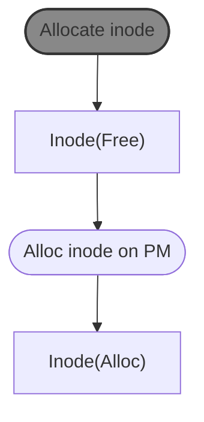
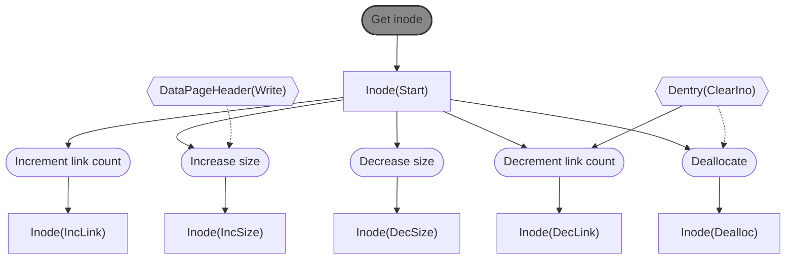
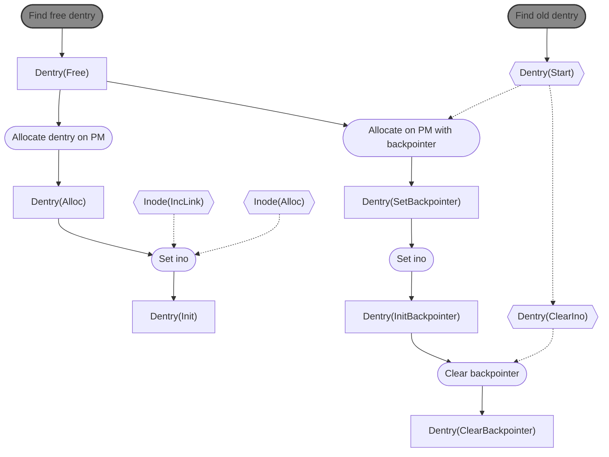
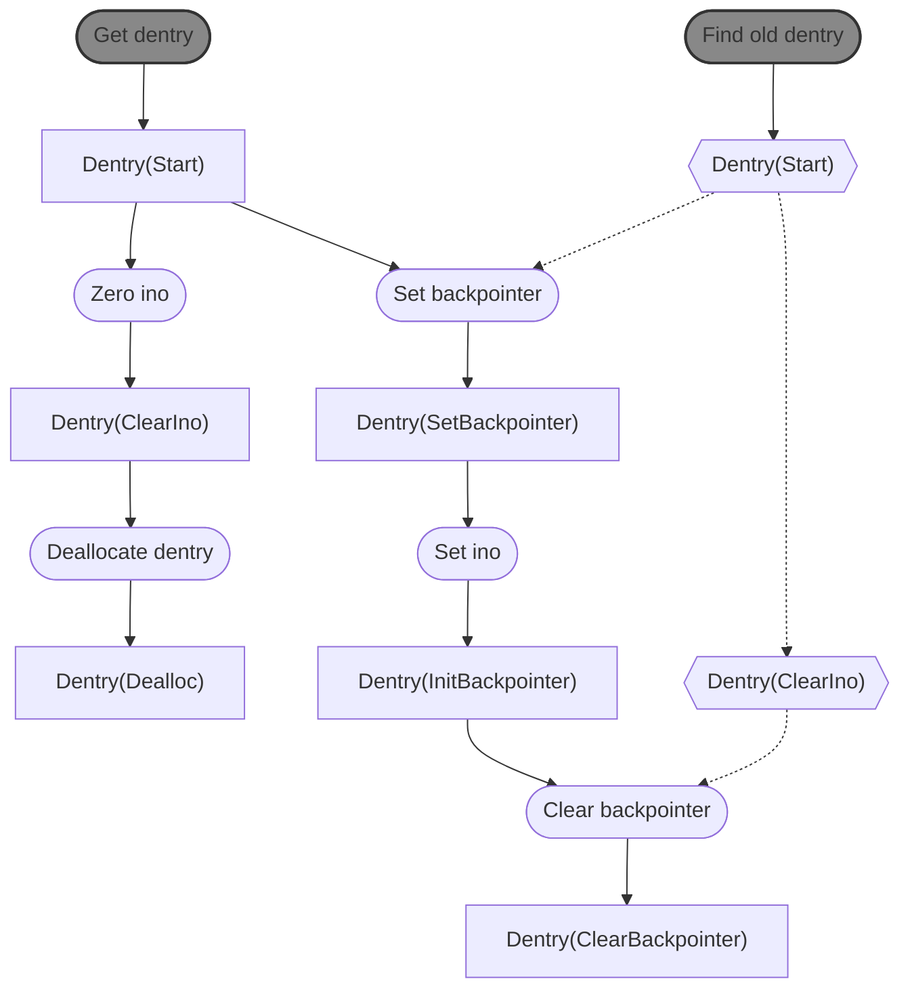
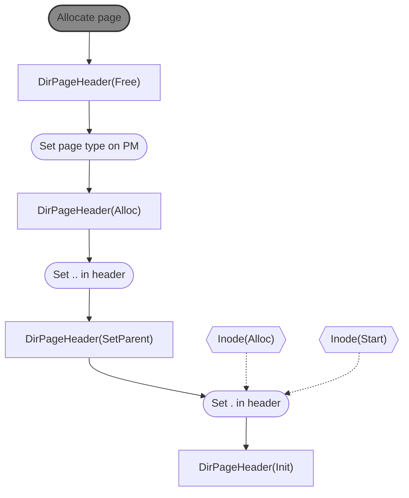
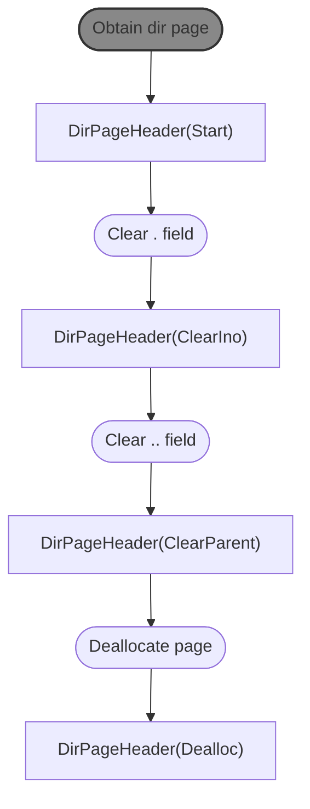

# Object Dependencies v1

Round nodes represent operations. Gray nodes indicate operations on DRAM specifically. Hexagon nodes indicate dependencies on other persistent objects. If multiple objects must be persistent before an operation, they will be listed in the same node; separate nodes indicate that there are multiple dependencies, only one of which must be satisfied. The dependencies here represent explicit persisted-before relationships and each object must be flushed/fenced before dependent operations can take place, so we only include soft updates operation typestate here (not persistence typestate).

**Inode initialization**

Allocating an inode on PM involves setting all of the fields in its first 64 bytes. Right now, inodes are smaller than 64 bytes; if they grow larger, we will need to adjust this diagram to account for flushing the subsequent bytes.

Safety:
- It's always safe to allocate an inode in an empty (completely zeroed out) slot; as long as no directory entry refers to it, doing so will just cause a space leak, even if the inode is fully initialized.

**Inode modification and deletion**

Safety:
- It's always safe to increase link count, since too-high link count is a valid space leak
- File size cannot be increased until there are data page(s) with that much data written to them
- It's always safe to decrease file size, since doing so can only cause space leaks
- Link count cannot be decremented until the corresponding dentry has been invalidated by clearing its ino field; a too-low link count is an illegal inconsistency
- Inode cannot be deallocated until the corresponding dentry has been invalidated by clearing its ino field; otherwise we risk a dangling pointer from the dentry to the deallocated inode or a violation of rule 2 (nullify all pointers to a resource before reusing it).

**Dentry initialization**

Allocating a dentry in PM involves setting its name field and any other metadata fields EXCEPT for the ino field. This diagram does NOT include dependencies for allocating/initializing . and .. dentries; these are a special case that is handled during `DirPageHeader` setup.

Safety:
- It's always safe to allocate a dentry in an empty (completely zeroed out slot). As long as its `ino` field is zeroed out, it does not refer to anything and just causes a space leak. 
- The `ino` field cannot be set for a dentry in `Alloc` state unless there is a newly-allocated *or* newly link-incremented inode for it to refer to. Otherwise, we risk a dangling pointer or a too-low link count, both of which are illegal inconsistencies.
- It *is* safe to set the `ino` field for a dentry in `SetBackpointer` state because the inode number comes from the old dentry (currently persistent in `Start` state), so the pointer won't dangle. Also, we've already set the backpointer to the old dentry, so we can roll back to the old name if necessary.
- It is not safe to clear the backpointer from a dentry in `InitBackpointer` state until the old dentry is in `ClearIno` state, since doing so would leave us unable to determine which two dentries were involved in the `rename` operation.
  - However, note that it is NOT safe to deallocate the old dentry until the new dentry is in `ClearBackpointer` state. If we were to free the old dentry before deleting the backpointer, we could break rule 2 of soft updates (nullify all pointers to a resource before reusing it) if the old dentry were re-allocated after a crash while the backpointer is still present in the new dentry.

**Dentry modification and deletion**

Dentries are only modified during `rename`; the only other time they are updated is to deallocate them in `unlink` or `rmdir`. 

Safety:
- It's always safe to zero a dentry's inode field; this can result in a space leak as the dentry itself is still allocated, and the corresponding inode + pages will leak if this dentry is the last name for the file, but space leaks are safe.
- It's safe to set the backpointer field in a `Start` dentry because the remount scan will ignore the backpointer if the inodes in the new and old dentries don't match. 
- The backpointer can't be cleared until the old dentry's inode is zeroed, as described above.

**Directory page allocation**

To make things a bit easier on ourselves, each `DirPageHeader` includes the . and .. directory entries. This wastes a small amount of space (we don't really need the .. in each dentry, but it will be very small) but simplifies `mkdir` and some other operations. 

Safety:
- It is always safe to allocate a new page as this can only cause a space leak.
- The .. entry in the header will be ignored unless the . entry is also set and refers to a valid inode (i.e. one that is pointed to by at least one non-header dentry), so it's safe to set before the inode is fully initialized. 
- The . entry cannot be set until we have an allocated inode for it to point to. This ensures we can't break rule 2 of soft updates after a crash.

**Directory page deallocation**

`DirPageHeader`s are only modifed at allocation and deallocation. They are *not* modified and their typestate is not involved when dentries in the page they head are updated.

We may be able to combine the .. clearing and deallocation into a single step.

Safety:
- A directory page should only be deallocated when it contains no more allocated dentries. Since the `DirPageHeader` structure does not include or keep track of dentries, we'll need to keep track of this in DRAM. This property won't be enforceable at compile time.
- Since the .. dentry is ignored if the . dentry is empty, clearing the . dentry makes the page unreachable from any file.

TODO: data pages